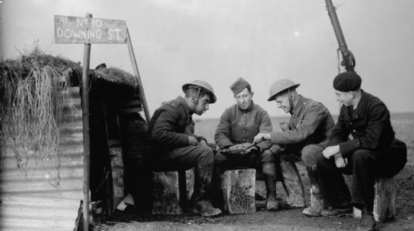

THE GERMAN INVASION AND FRENCH DEFEAT
 When war erupted in 1939, France mobilized against a traditional enemy,
Germany. French society had faced Germany less than a quarter century before. This
paper explores how the German military conquest of France in the summer of 1940
changed the government of France. It changed from a constitutional democracy to a
totalitarian regime under the French hero of Verdun who earned his fame during the
Great War. Marshal Philippe Pétain was that hero. During the course of World War II
significant Vichy French leaders clandestinely and French society in general would
eventually defy the dictate of Nazi Germany. This aided the Allied cause in spite of the
armistice called for by Pétain in June 1940.

 There is a great deal of debate among historians concerning what role the
government and populace of Vichy France played in the outcome of World War II.
American historian Robert Paxton wrote: “no one who lived through the French debacle
of May-June 1940 ever got over the shock. For Frenchmen, confident of a special role in
the world, the six weeks’ defeat by German armies was a shattering trauma.”
 The unexpected rapid defeat of France shattered the confidence of the Allies in their quest to
curb or if possible halt Hitler’s blatant aggression and obvious intension to dominate
Europe and the World.
 In 1940 the renowned French historian and resistance fighter Marc Bloch wrote a
first-hand account of the German invasion and rapid collapse of France, which occurred
during his service as a reserve officer in the French army. The significance of Bloch’s
account was it provided historians a view of the military collapse of France through the
eyes of a first-rate historian whose critical faculty and all the penetrating analysis added
credibility to the account far in excess of a typical narrative. In this work, Bloch
agonizingly struggled with why France and the French army were so inefficient in
defense of the homeland. Bloch, after significant analysis, concluded that the main cause
of the disaster was the incompetent French High Command as well as other important
factors including how French national solidarity had been comprised since 1870. Bloch
intuitively wrote: “the duty of reconstructing our country will not fall on the shoulders of
my generation. France in defeat will be seen to have had a Government of old men. That
is but natural. France of the new springtime must be the creation of the young.”
Historians continue to write and argue the copious factors that caused the rapid collapse
of the French army in 1940 but it is difficult for any to exceed the insight and analysis of
Marc Bloch.
 The catastrophic defeat that Bloch described was a reality and by the middle of
June 1940, the government leaders in Paris were packing up their offices and preparing to
leave Paris to the German invader. What to do now? It was apparent that someone had to
step forward and deal with Adolf Hitler while keeping order in France and its colonies. 
Who amid all the chaos commanded the instant respect and possessed legitimacy with the
French people? One possibility was Marshal Henri Phillipe Pétain, the hero of Verdun,
advocate of the Maginot Line, and recently named Paul Reynaud’s vice-premier. As the
victorious German army marched into Paris, on June 16, 1940, French Prime Minister
Paul Reynaud resigned in favor of a hero of the First World War, Marshal Pétain who
immediately requested terms for an armistice from Hitler. The Third Republic had
collapsed.
 It should be noted that only eight months prior to the collapse M. Edouard
Daladier, President of the Council of Ministers, had proclaimed in Paris to the French
people “Men and women of France! We are waging war because it has been thrust on us.
Every one of us is at his post, on the soil of France, on that land of liberty where respect
of human dignity finds one of its last refuges. You will all cooperate, with a profound
feeling of union and brotherhood, for the salvation of the country, Vive la France!”

